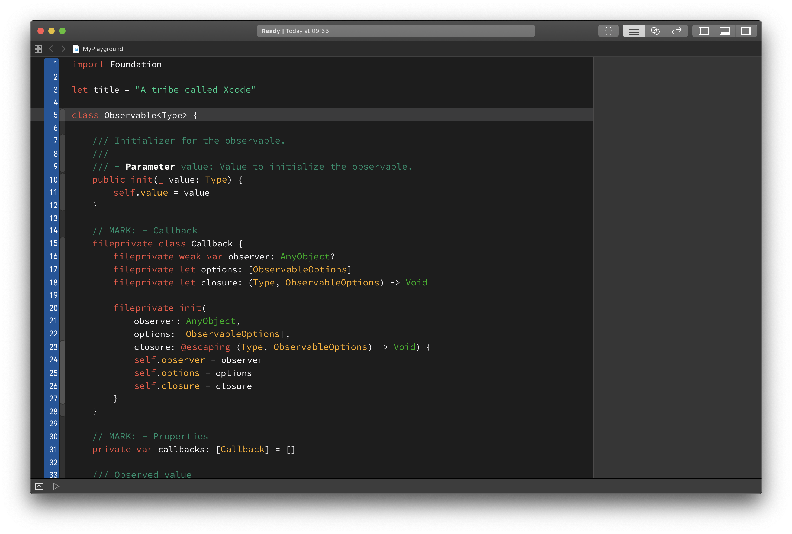

# A Tribe Called Xcode Theme

This theme is inspired by the cover art of A Tribe Called Quest.



## Installing manually

1. Clone this repo:
```
$ git clone https://github.com/mltbnz/A-Tribe-Called-Xcode.git
```

2. Create a folder at this path if it doesn't exist already:
```
~/Library/Developer/Xcode/UserData/FontAndColorThemes
```

3. Copy the file `ATCX.xccolortheme` into the above folder.

4. Download the latest release of Source Code Pro from [its repo](https://github.com/adobe-fonts/source-code-pro).

5. Unzip the font archive and move the files in the `TTF` folder to `~/Library/Fonts`.